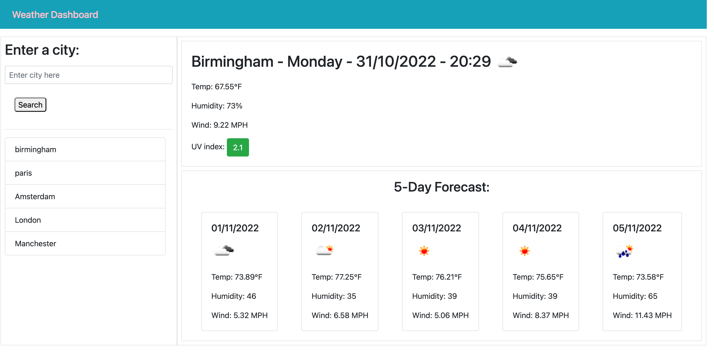

# Weather Dashboard

## Overview

In this project, i created a weather dashboard that displayed the current weather conditions in that city. It also included the temperature, humidity, UV index and a picture representing whether it is cloudy, clear, snowing etc. Additionally, it included a 5-day forecast for the city searched below the current weather conditions showing similar information.

The application is a website using OpenWeather One Call API and the cities entered by the user would be rendered by the API.

## Technologies

- HTML
- CSS
- Javascript
- JQuery

## ScreenShot

# Link

Github URL - https://github.com/ramlaahmed/weatherDashboard

Deployed URL - https://ramlaahmed.github.io/weatherDashboard/
